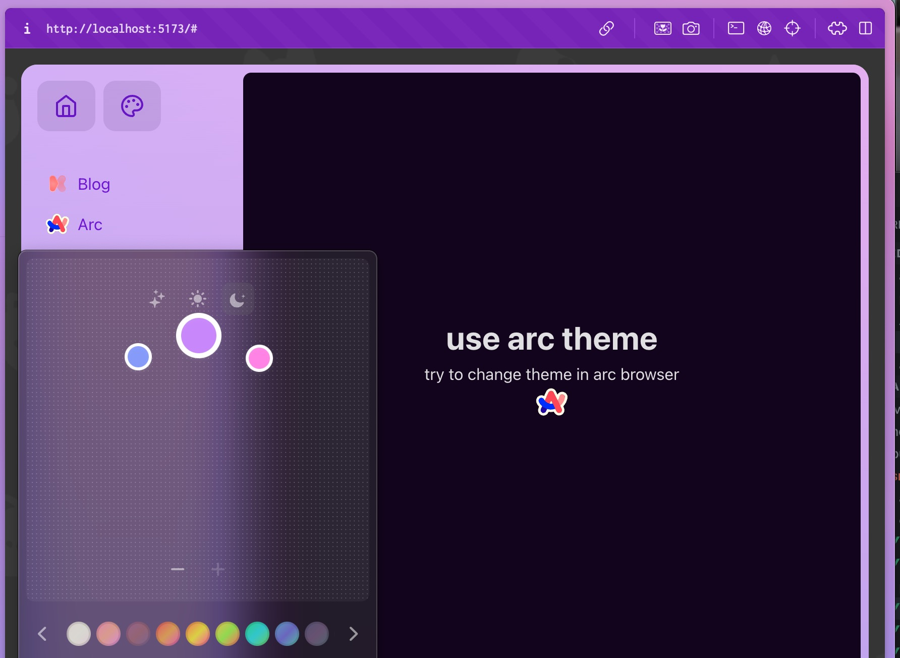
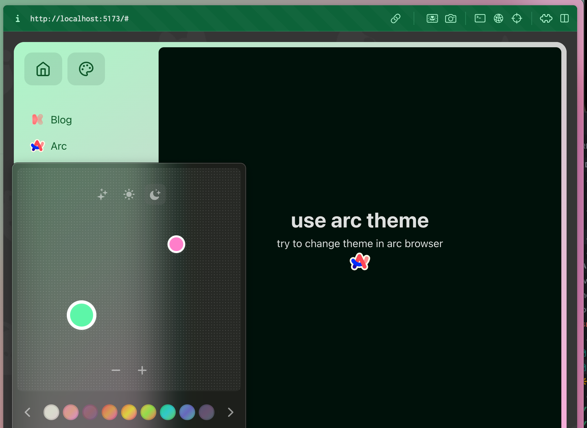

## 简介

Arc 浏览器有一个 theme 功能，可以改变 Arc 的外观，同时 Arc 还会将这些 theme 参数通过用户代理样式表（User Agent StyleSheet）注入到浏览器。

Arc browser has a theme feature that can change the appearance of Arc, and Arc will also inject these theme parameters into the browser through a User Agent StyleSheet.

于是，此项目诞生了。通过使用 Arc 提供的 css 变量，来实现网站的主题功能。

So, this project was born. By using CSS variables provided by Arc, the theme function of the website can be achieved.

